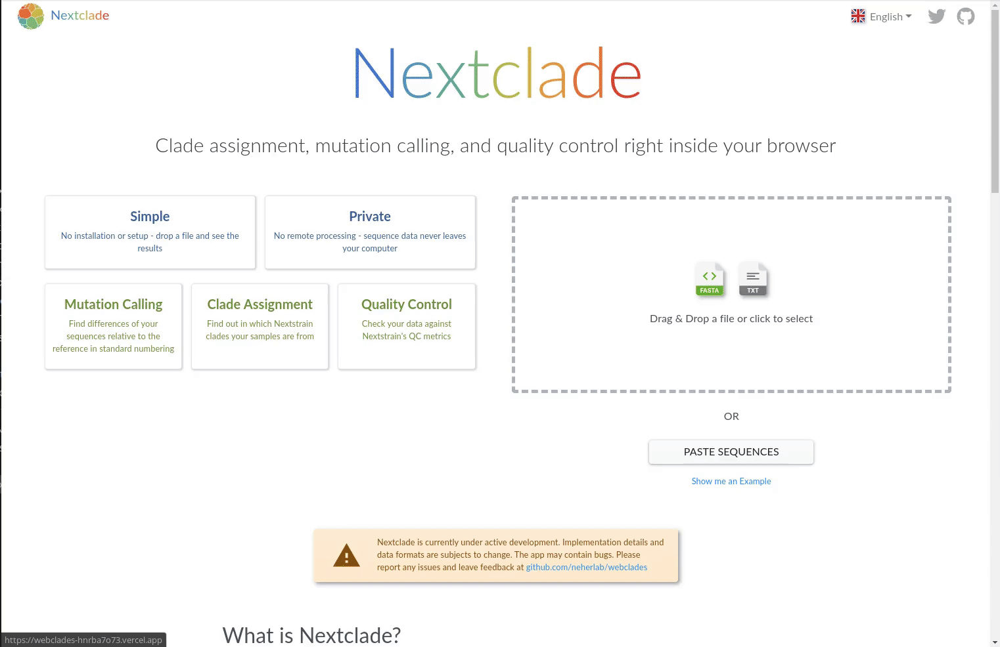

<h1 id="nextclade" align="center">
Nextclade
</h1>

<h4 id="nextclade" align="center">
Clade assignment, mutation calling, and quality control right inside your browser
</h1>

<p align="center">
  <a target="_blank" rel="noopener noreferrer" href="https://clades.nextstrain.org" alt="Link to our website">
    🌐 clades.nextstrain.org
  </a>
</p>

<blockquote align="center">
Nextclade is a simple web-tool to assign <a target="_blank" rel="noopener noreferrer" href="https://nextstrain.org">Nextstrain</a> <a target="_blank" rel="noopener noreferrer" href="https://en.wikipedia.org/wiki/Clade">clade</a> to the <a target="_blank" rel="noopener noreferrer" href="https://en.wikipedia.org/wiki/Severe_acute_respiratory_syndrome_coronavirus_2">SARS-CoV-2</a> <a target="_blank" rel="noopener noreferrer" href="https://en.wikipedia.org/wiki/DNA_sequencing">sequences</a>.
</blockquote>

<p align="center">
  <a href="docs/assets/ui.gif" target="_blank" rel="noopener noreferrer"  alt="Link to animated screenshot of the application, showcasing the user interface on main page">
    
  </a>
</p>

<p align="center">
  <a target="_blank" rel="noopener noreferrer" href="LICENSE">
    
  </a>

  <a href="packages/web/package.json">
    
  </a>
  <a href="https://clades.nextstrain.org/">
    
  </a>
  <a href="https://staging.clades.nextstrain.org/">
    
  </a>
  <a href="https://master.clades.nextstrain.org/">
    
  </a>
</p>

<p align="center">
  <a href="https://travis-ci.org/github/neherlab/webclades/branches">
    
  </a>
  <a href="https://travis-ci.org/github/neherlab/webclades/branches">
    
  </a>

  <a href="https://travis-ci.org/github/neherlab/webclades/branches">
    
  </a>

  <a href="https://snyk.io/test/github/neherlab/webclades?targetFile=package.json">
    
  </a>
  <a href="https://securityheaders.com/?q=clades.nextstrain.org&followRedirects=on">
    
  </a>
  <a href="https://observatory.mozilla.org/analyze/clades.nextstrain.org">
    
  </a>
</p>

<p align="center">

  <a href="https://deepscan.io/dashboard#view=project&tid=8207&pid=12611&bid=195750">
    
  </a>

  <a href="https://codeclimate.com/github/neherlab/webclades">
    
  </a>

  <a href="https://codeclimate.com/github/neherlab/webclades">
    
  </a>

  <a href="https://codecov.io/gh/neherlab/webclades">
    
  </a>

</p>

<p align="center">
  <a href="https://david-dm.org/neherlab/webclades">
    
  </a>

  <a href="https://david-dm.org/neherlab/webclades?type=dev">
    
  </a>

  <a href="https://github.com/neherlab/webclades/commits">
    
  </a>

  <a href="https://github.com/neherlab/webclades/commits">
    
  </a>

  <a href="https://github.com/neherlab/webclades/graphs/contributors">
    
  </a>
</p>

## 🖥️ Developers guide

### Quick start

Install the requirements:

- <a target="_blank" rel="noopener noreferrer" href="https://git-scm.com/downloads">Git</a> >= 2.0
- <a target="_blank" rel="noopener noreferrer" href="https://nodejs.org/">Node.js</a> >= 12 (we recommend installation through <a target="_blank" rel="noopener noreferrer" href="https://github.com/nvm-sh/nvm">nvm</a> or
  <a target="_blank" rel="noopener noreferrer" href="https://github.com/coreybutler/nvm-windows">nvm-windows</a>)
- 1.0 < yarn < 2.0

In order to run the application in development mode, run:

```bash
git clone https://github.com/neherlab/webclades
cd webclades/packages/web
cp .env.example .env
yarn install
yarn dev

```

(on Windows, substitute `cp` with `copy`)

This will trigger the development server and build process. Wait for the build to finish, then navigate to
`http://localhost:3000` in a browser (last 5 versions of Chrome or Firefox are supported in development mode).

### Production build

In order to replicate the production build locally, use this command:

```bash

yarn prod:watch

```

This should build the application in production mode and start a static server that will serve the app on
`http://localhost:8080` (by default)

## ✨ Contributors

We are thankful to all our contributors, no matter how they contribute: in ideas, science, code, documentation or
otherwise. Thanks goes to these wonderful people (<a target="_blank" rel="noopener noreferrer" href="https://allcontributors.org/docs/en/emoji-key">emoji key</a>:

<!-- ALL-CONTRIBUTORS-LIST:START - Do not remove or modify this section -->
<!-- prettier-ignore-start -->
<!-- markdownlint-disable -->

<!-- markdownlint-enable -->
<!-- prettier-ignore-end -->

<!-- ALL-CONTRIBUTORS-LIST:END -->

This project follows the <a target="_blank" rel="noopener noreferrer" href="https://github.com/all-contributors/all-contributors">all-contributors</a> specification. Contributions of any kind welcome!

In order to find the usernames of contributors missing from this list run:

```
yarn all-contributors check

```

To add a contributor to the list, run:

```
yarn all-contributors add <contribution_type_1>,<contribution_type_2>,...

```

(see list of contribution types <a target="_blank" rel="noopener noreferrer" href="https://allcontributors.org/docs/en/emoji-key">here</a>)

To re-generate the list, run:

```
yarn all-contributors generate

```

## License

<a target="_blank" rel="noopener noreferrer" href="LICENSE" alt="License file">MIT License</a>
