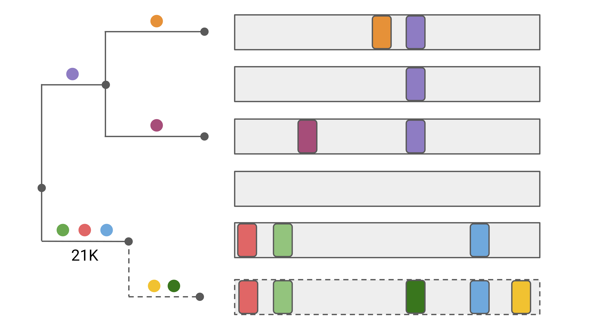
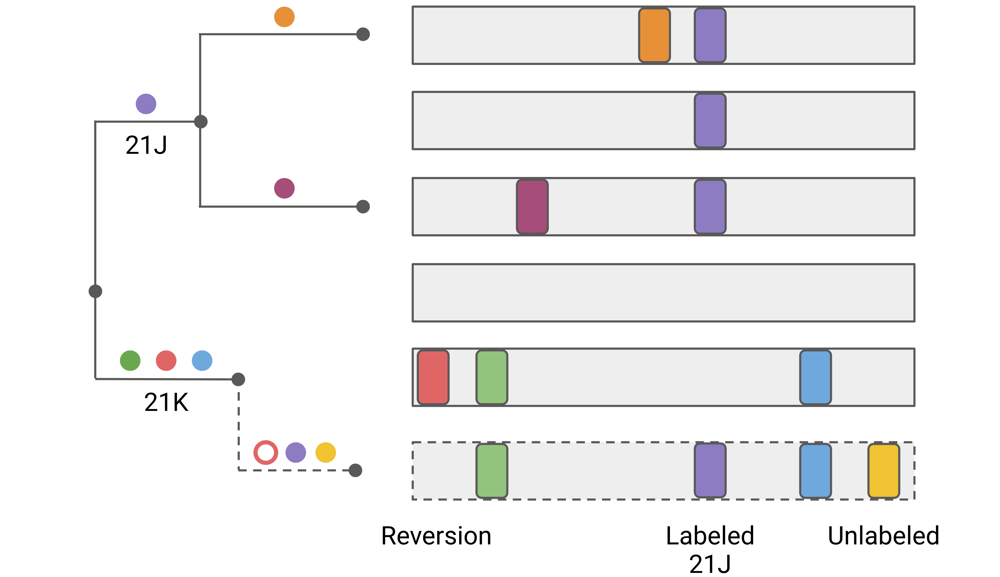

# 7. Quality Control (QC)

[Whole-genome sequencing](https://en.wikipedia.org/wiki/Whole_genome_sequencing) of viruses is a complex biotechnological process. Results can vary significantly in their quality, in particular, from scarce or degraded input material. Some parts of the sequence might be missing and the bioinformatic analysis pipelines that turn raw data into a consensus genome sometimes produce artefacts. Such artefacts typically manifest in spurious differences of the sequence from the reference.

If such problematic sequences are included in a phylogenetic analysis, they can distort the resulting tree. For example, the [Nextstrain](https://nextstrain.org) analysis pipeline therefore excludes sequences deemed problematic. Many such problems can be fixed by tweaking the pipeline or removing contaminants. It is therefore useful to spot these problems as early as possible.

Nextclade scans each query sequence for issues which may indicate problems occurring during sequencing or assembly. It implements several Quality Control (QC) to flag sequences as potentially problematic. Individual rules produce various metrics, specific to each rule as well as numeric quality scores.

## Quality scores

For each query sequence each individual QC rule produces a quality score. These **individual QC scores** are empirically calibrated to fit the following thresholds:

| Score         | Meaning            | Color designation |
| ------------- | ------------------ | ----------------- |
| 0 to 29       | "good" quality     | green             |
| 30 to 99      | "mediocre" quality | yellow            |
| 100 and above | "bad" quality      | red               |

After all scores are calculated, the **final QC score** ``$` S `$`` is calculated as follows:

```math
S = \sum_i \frac{S_i^2}{100}
```

where ``$` S_i `$`` is the score for an individual QC rule ``$` i `$``.

With this quadratic aggregation, multiple mildly concerning scores don't result in a bad overall score, but a single bad score guarantees a bad overall score.

The final score has the same thresholds as the the individual scores.

## Individual QC Rules

For SARS-CoV-2, we currently implement the following QC rules (in parentheses are the one-letter designations used in [Nextclade Web](../nextclade-web)). For other viruses, such as influenza, the same QC rules are used. However, the parametrization is different. The exact parameters can be found in the `pathogen.json` input file. Datasets provided by Nextclade can be inspected in the GitHub repo [nextstrain/nextclade_data](https://github.com/nextstrain/nextclade_data).

### Missing data (N)

If your sequence misses more than 3000 sites (`N` characters), it will be flagged as `bad`. The first 300 missing sites are not penalized (`scoreBias`). After that the score goes linearly from 0-100 as the number `N`s goes from 300 to 3000 (`scoreBias + missingDataThreshold`).

### Mixed sites (M)

Ambiguous nucleotides (such as `R`, `Y`, etc) are often indicative of contamination (or superinfection) and more than 10 (`mixedSitesThreshold`) such non-ACGTN characters will result in a QC flag `bad`.

### Private mutations (P)

In order to assign clades, Nextclade places sequences on a reference tree that is representative of the global phylogeny (see figure below). The query sequence (dashed) is compared to all sequences (including internal nodes) of the reference tree to identify the nearest neighbor.

As a by-product of this placement, Nextclade identifies the mutations, called "private mutations", that differ between the query sequence and the nearest neighbor sequence. In the figure, the yellow and dark green mutations are private mutations, as they occur in addition to the 3 mutations of the attachment node.



Many sequence quality problems are identifiable by the presence of private mutations. Sequences with unusually many private mutations are unlikely to be biological and are thus flagged as bad.

Since web version 1.13.0 (CLI 1.10.0), Nextclade classifies private mutations further into 3 categories to be more sensitive to potential contamination, co-infection and recombination:

1. Reversions: Private mutations that go back to the reference sequence, i.e. a mutation with respect to reference is present on the attachment node but not on the query sequence.
2. Labeled mutations: Private mutations to a genotype that is known to be common in a clade.
3. Unlabeled mutations: Private mutations that are neither reversions nor labeled.

For an illustration of these 3 types, see the figure below.



Reversions are common artefacts in some bioinformatic pipelines when there is amplicon dropout.
They are also a sign of contamination, co-infection or recombination. Labeled mutations also contain commonly when there's contamination, co-infection or recombination.

Reversions and labeled mutations are weighted several times higher than unlabeled mutations due to their higher sensitivity and specificity for quality problems (and recombination).
In February 2022, every reversion was counted 6 times (`weightReversionSubstitutions`) while every labeled mutation was counted 4 times (`weightLabeledSubstitutions`). Unlabeled mutations get weight 1 (`weightUnlabeledSubstitutions`).

From the weighted sum, 8 (`typical`) is subtracted. The score is then a linear interpolation between 0 and 100 (and above), where 100 corresponds to 24 (`cutoff`).

Private deletion ranges (including reversion) are currently counted as a single unlabeled substitution, but this could change in the future.

Which genotypes get "labeled" is determined in the dataset config file `virus_properties.json` which can also be found in the [Github repo](https://github.com/nextstrain/nextclade_data/blob/master/data/datasets/sars-cov-2/references/MN908947/versions/2022-02-07T12:00:00Z/files/virus_properties.json).
Currently, all mutations that appear in at least 30% of the sequences of a clade or in at least 100k sequences in a clade get that clade's label.

### Mutation clusters (C)

To be more sensitive for quality problems in a narrow area of a genome, the mutation cluster rule counts the number of private within all possible 100-nucleotide windows (`windowSize`).
If that number exceeds 6 (`clusterCutOff`), this counts as a SNP cluster.
The quality score is the number of clusters times 50 (`scoreWeight`), hence 1 cluster will cause the cluster rule to be mediocre.

### Stop codons (S)

Replicating viruses can not have premature stop codons in essential genes and such premature stops are hence an indicator of problematic sequences.

However, some stop codons are known to be common even in functional viruses. Our stop codon rule excludes such known stop codons `ignoredStopCodons` and assigns a QC score of 75 to each premature stop, hence if there are 2 unknown stop codons, the score is 150.

Beware that the position of known stop codons in `pathogen.json` is 0-indexed, in contrast to the 1-indexed positions that are used in Nextclade outputs.

### Frame shifts (F)

Frame shifting insertions or deletions typically result in a garbled translation or a premature stop. Nextalign currently doesn't translate frame shifted coding sequences and each frame shift is assigned a QC score 75. Note, however, that clade 21H (Mu) has a frame shift towards the end of ORF3a that results in a premature stop. Known frame shifts (those listed in `ignoredFrameShifts`) in `pathogen.json` are not penalized.

## Interpretation

Nextclade's QC warnings don't necessarily mean your sequences are problematic, but these issues warrant closer examination. You may explore the rest of the analysis results for the flagged sequences to make the decision.

The numeric QC scores are useful for rough estimation of the quality of sequences. However, these values are empirical. They only hint on possible issues, the possible scale of these issues and call for further investigation. They do not have any other meaning or application.

The [Nextstrain SARS-CoV-2 pipeline](https://github.com/nextstrain/ncov) uses similar (more lenient) QC criteria. For example, Nextstrain will exclude your sequence if it has fewer than 27000 valid bases (corresponding to roughly 3000 Ns) and doesn't check for ambiguous characters. Sequences flagged for excess divergence and SNP clusters by Nextclade are likely excluded by Nextstrain.

Note that there are many additional potential problems Nextclade does not check for. These include for example: primer sequences or adapters.

## Configuration

QC checks can be enabled or disabled, and their parameters can be changed by modifying `qc` field in the `pathogen.json` file in the Advanced mode of [Nextclade Web](../nextclade-web) or in [Nextclade CLI](../nextclade-cli).

## Results

QC results are presented in the "QC" column of the results table in [Nextclade Web](../nextclade-web). More information is included into mouseover tooltips.

QC results are also included in the analysis results JSON, CSV and TSV files generated by [Nextclade CLI](../nextclade-cli) and in the "Download" dialog of [Nextclade Web](../nextclade-web).
