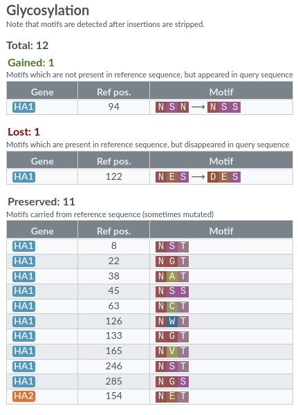

## Pathogen configuration

Nextclade Web (advanced mode): accepted in "Pathogen JSON" drag & drop box. A remote URL is also accepted in `input-pathogen-json` URL parameter.

Nextclade CLI: `--input-pathogen-json`/`-R`

General Nextclade dataset configuration can be passed in the JSON config file `pathogen.json`. Top level keys and their values are explained in detail below.

### Required

#### `schemaVersion`

Required. Currently `3.0.0`.

#### `files`

Required. Tells Nextclade what the file names of other dataset input files are. Only `reference` and `pathogenJson` are required.

Example:

```json
{
  "files": {
    "reference": "reference.fasta",
    "pathogenJson": "pathogen.json",
    "genomeAnnotation": "genome_annotation.gff3",
    "treeJson": "tree.json",
    "examples": "sequences.fasta",
    "readme": "README.md",
    "changelog": "CHANGELOG.md"
  }
}
```

See [Input files](../input-files/index.rst) section for more details.

### Optional

#### `attributes`

A set of attributes to display in Nextclade Web and Nextclade CLI for datasets to be recognizable visually. The attributes `name`, `reference name` and `reference accession` are the most used, but can contain any set of attributes.

Example:

```json
{
  "attributes": {
    "name": "SARS-CoV-2 rooted on BA.2",
    "reference name": "Prototypical BA.2 in Wuhan-Hu-1 coordinates",
    "reference accession": "pseudo-BA.2"
  }
}
```

#### `qc`

Optional. Quality control (QC) configuration. If not provided, Nextclade does not do any QC checks. Details of the QC algorithms and their parameters are described in [Algorithm: Quality control](../algorithm/06-quality-control.md).

> ⚠️ Positions in the input files are 0-indexed and ranges are semi-open (ends are excluded). So `ORF3a:257-276` should be encoded as `{"begin": 256, "end": 276 }`.

Example configuration for SARS-CoV-2:

```json
{
  "qc": {
    "privateMutations": {
      "enabled": true,
      "typical": 8,
      "cutoff": 24,
      "weightLabeledSubstitutions": 4,
      "weightReversionSubstitutions": 6,
      "weightUnlabeledSubstitutions": 1
    },
    "missingData": {
      "enabled": true,
      "missingDataThreshold": 2700,
      "scoreBias": 300
    },
    "snpClusters": {
      "enabled": true,
      "windowSize": 100,
      "clusterCutOff": 6,
      "scoreWeight": 50
    },
    "mixedSites": {
      "enabled": true,
      "mixedSitesThreshold": 10
    },
    "frameShifts": {
      "enabled": true,
      "ignoredFrameShifts": [
        {
          "geneName": "ORF3a",
          "codonRange": {
            "begin": 256,
            "end": 276
          }
        },
        {
          "geneName": "ORF3a",
          "codonRange": {
            "begin": 258,
            "end": 276
          }
        }
      ]
    },
    "stopCodons": {
      "enabled": true,
      "ignoredStopCodons": [
        {
          "geneName": "ORF8",
          "codon": 26
        },
        {
          "geneName": "ORF8",
          "codon": 67
        }
      ]
    }
  }
}
```

#### `compatibility`

Optional. Minimum Nextclade CLI/web version required to use this dataset. If not provided, no compatibility checks are performed.

Example:

```json
{
  "compatibility": {
    "cli": "3.0.0",
    "web": "3.0.0"
  }
}
```

#### `defaultCds`

Optional `str`. The default gene/CDS to be shown in Nextclade web. If not provided, the nucleotide alignment is shown. Example value: `"S"`.

#### `cdsOrderPreference`

Optional `array[str]`. Order in which genes are shown in Nextclade web dropdown. Example value `["S", "ORF1a", "N", "E"]`

#### `generalParams`

Optional `dict[str,bool]`. General flags that affect the analysis and output. These are identical to the corresponding CLI arguments. If not provided, default values are used.

- `includeReference`: Whether to include aligned reference nucleotide sequence into output nucleotide sequence FASTA file and reference peptides into output peptide FASTA files.
- `inOrder`: Emit output sequences in-order. With this flag the program will wait for results from the previous sequences to be written to the output files before writing the results of the next sequences, preserving the same order as in the input file. Due to variable sequence processing times, this might introduce unnecessary waiting times, but ensures that the resulting sequences are written in the same order as they occur in the inputs (except for sequences which have errors). By default, without this flag, processing might happen out of order, which is faster, due to the elimination of waiting, but might also lead to results written out of order - the order of results is not specified and depends on thread scheduling and processing times of individual sequences. This option is only relevant when `--jobs` is greater than 1 or is omitted. Note: the sequences which trigger errors during processing will be omitted from outputs, regardless of this flag.
- `replaceUnknown`: Replace unknown nucleotide characters with 'N'. By default, the sequences containing unknown nucleotide characters are skipped with a warning - they are not analyzed and not included into results. If this flag is provided, then before the alignment, all unknown characters are replaced with 'N'. This replacement allows to analyze these sequences which otherwise result in an error. The following characters are considered known: '-', 'A', 'B', 'C', 'D', 'G', 'H', 'K', 'M', 'N', 'R', 'S', 'T', 'V', 'W', 'Y'.

#### `alignmentParams`

Optional `dict`. Parameters for the alignment algorithm. These are identical to the corresponding CLI arguments (though here _camelCase_ needs to be used. If not provided, default values are used.

#### `treeBuilderParams`

Optional `dict`. Parameters for the tree building algorithm. These are identical to the corresponding CLI arguments (though here _camelCase_ needs to be used. If not provided, default values are used.

- `withoutGreedyTreeBuilder`: If you don't want to use the greedy tree builder, set this to `true`. Default: `false`.
- `maskedMutsWeight`: Parsimony weight for masked mutations. Default: `0.05`.

#### `primers`

TODO

#### `phenotypeData`

TODO

#### `aaMotifs`

Nextclade can detect and report specific motifs in translated amino acid sequences. This feature is currently being used to highlight changes in glycosylation or cleavage sites, but the feature itself is generic.
Amino acid motifs can be specified using regular expressions and the parts of the genome in which Nextclade searches for the motifs is specified by listing the CDS and (optional) ranges within these CDSs (e.g.~to restrict to the exposed part of a protein).
An example of a full configuration (for glycosylation in influenza HA) is shown below.
```json
  "aaMotifs": [
    {
      "name": "glycosylation",
      "nameShort": "Glyc.",
      "nameFriendly": "Glycosylation",
      "description": "N-linked glycosylation motifs (N-X-S/T with X any amino acid other than P)",
      "includeCdses": [
        {
          "cds":"HA1",
          "ranges":[]
        },
        {
          "cds":"HA2",
          "ranges":[{"begin":0, "end":186}]
        }
      ],
      "motifs": [
        "N[^P][ST]"
      ]
    }
  ]
```
In the web interface, motifs are reported as shown in the screenshot below:


#### `mutLabels`

TODO

> 💡 Nextclade CLI supports file compression and reading from standard input. See section [Compression, stdin](./compression.md) for more details.
