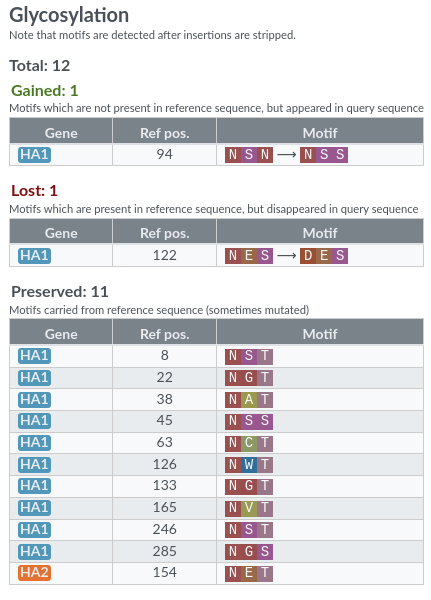

## Pathogen configuration

Nextclade Web (advanced mode): accepted in "Pathogen JSON" drag & drop box. A remote URL is also accepted in `input-pathogen-json` URL parameter.

Nextclade CLI: `--input-pathogen-json`/`-R`

General Nextclade dataset configuration can be passed in the JSON config file `pathogen.json`. Top level keys and their values are explained in detail below.

> 💡 **JSON Schema Available**: For validation and code generation, use `nextclade schema write --for input-pathogen-json` to generate a JSON Schema for this format. See the [JSON Schema documentation](https://github.com/nextstrain/nextclade/tree/release/packages/nextclade-schemas) for details.

### Required

#### `schemaVersion`

Required. Currently `3.0.0`.

#### `files`

Required for datasets (not enforced by the JSON schema). Tells Nextclade what the file names of other dataset input files are. Only `reference` and `pathogenJson` are required.

Example:

```json
{
  "files": {
    "reference": "reference.fasta",
    "pathogenJson": "pathogen.json",
    "genomeAnnotation": "genome_annotation.gff3",
    "treeJson": "tree.json",
    "examples": "sequences.fasta",
    "readme": "README.md",
    "changelog": "CHANGELOG.md"
  }
}
```

See [Input files](../input-files/index.rst) section for more details.

### Optional

#### `attributes`

A set of attributes to display in Nextclade Web and Nextclade CLI for datasets to be recognizable visually. The attributes `name`, `reference name` and `reference accession` are the most used, but can contain any set of attributes.

Example:

```json
{
  "attributes": {
    "name": "SARS-CoV-2 rooted on BA.2",
    "reference name": "Prototypical BA.2 in Wuhan-Hu-1 coordinates",
    "reference accession": "pseudo-BA.2"
  }
}
```

#### `qc`

Optional. Quality control (QC) configuration. If not provided, Nextclade does not do any QC checks. Details of the QC algorithms and their parameters are described in [Algorithm: Quality control](../algorithm/06-quality-control.md).

> ⚠️ Positions in the input files are 0-indexed and ranges are semi-open (ends are excluded). So `ORF3a:257-276` should be encoded as `{"begin": 256, "end": 276 }`.

Example configuration for SARS-CoV-2:

```json
{
  "qc": {
    "privateMutations": {
      "enabled": true,
      "typical": 8,
      "cutoff": 24,
      "weightLabeledSubstitutions": 4,
      "weightReversionSubstitutions": 6,
      "weightUnlabeledSubstitutions": 1,
      "weightLabeledDeletions": 1,
      "weightReversionDeletions": 1,
      "weightUnlabeledDeletions": 1
    },
    "missingData": {
      "enabled": true,
      "missingDataThreshold": 2700,
      "scoreBias": 300
    },
    "snpClusters": {
      "enabled": true,
      "windowSize": 100,
      "clusterCutOff": 6,
      "scoreWeight": 50
    },
    "mixedSites": {
      "enabled": true,
      "mixedSitesThreshold": 10
    },
    "frameShifts": {
      "enabled": true,
      "ignoredFrameShifts": [
        {
          "cdsName": "ORF3a",
          "codonRange": {
            "begin": 256,
            "end": 276
          }
        },
        {
          "cdsName": "ORF3a",
          "codonRange": {
            "begin": 258,
            "end": 276
          }
        }
      ]
    },
    "stopCodons": {
      "enabled": true,
      "ignoredStopCodons": [
        {
          "cdsName": "ORF8",
          "codon": 26
        },
        {
          "cdsName": "ORF8",
          "codon": 67
        }
      ]
    }
  }
}
```

#### `compatibility`

Optional. Minimum Nextclade CLI/web version required to use this dataset. If not provided, no compatibility checks are performed.

Example:

```json
{
  "compatibility": {
    "cli": "3.0.0",
    "web": "3.0.0"
  }
}
```

#### `defaultCds`

Optional `str`. The default gene/CDS to be shown in Nextclade web. If not provided, the nucleotide alignment is shown. Example value: `"S"`.

#### `cdsOrderPreference`

Optional `array[str]`. Order in which genes are shown in Nextclade web dropdown. Example value `["S", "ORF1a", "N", "E"]`

#### `generalParams`

Optional `dict[str,bool]`. General flags that affect the analysis and output. These are identical to the corresponding CLI arguments. If not provided, default values are used.

- `includeReference`: Whether to include aligned reference nucleotide sequence into output nucleotide sequence FASTA file and reference peptides into output peptide FASTA files.
- `inOrder`: Emit output sequences in-order. With this flag the program will wait for results from the previous sequences to be written to the output files before writing the results of the next sequences, preserving the same order as in the input file. Due to variable sequence processing times, this might introduce unnecessary waiting times, but ensures that the resulting sequences are written in the same order as they occur in the inputs (except for sequences which have errors). By default, without this flag, processing might happen out of order, which is faster, due to the elimination of waiting, but might also lead to results written out of order - the order of results is not specified and depends on thread scheduling and processing times of individual sequences. This option is only relevant when `--jobs` is greater than 1 or is omitted. Note: the sequences which trigger errors during processing will be omitted from outputs, regardless of this flag.
- `replaceUnknown`: Replace unknown nucleotide characters with 'N'. By default, the sequences containing unknown nucleotide characters are skipped with a warning - they are not analyzed and not included into results. If this flag is provided, then before the alignment, all unknown characters are replaced with 'N'. This replacement allows to analyze these sequences which otherwise result in an error. The following characters are considered known: '-', 'A', 'B', 'C', 'D', 'G', 'H', 'K', 'M', 'N', 'R', 'S', 'T', 'V', 'W', 'Y'.
- `includeNearestNodeInfo`: Whether to include nearest node information in the output.

#### `alignmentParams`

Optional `dict`. Parameters for the alignment algorithm. These are identical to the corresponding CLI arguments (though here _camelCase_ needs to be used). If not provided, default values are used.

An `alignmentPreset` field can be used as a shorthand for common parameter combinations: `"default"`, `"high-diversity"`, or `"short-sequences"`. Individual parameters override the preset values.

#### `treeBuilderParams`

Optional `dict`. Parameters for the tree building algorithm. These are identical to the corresponding CLI arguments (though here _camelCase_ needs to be used). If not provided, default values are used.

- `withoutGreedyTreeBuilder`: If you don't want to use the greedy tree builder, set this to `true`. Default: `false`.
- `maskedMutsWeight`: Parsimony weight for masked mutations. Default: `0.05`.

#### Multi-reference dataset suggestion (`minimizerIndex`)

Optional. Configures how the dataset is detected from query sequences by `nextclade sort` and the auto-detection in Nextclade Web. This affects only dataset suggestion -- it does not change alignment, mutation calling, or any analysis output.

By default, Nextclade builds a detection fingerprint from the dataset's main reference sequence (`reference.fasta`). For genetically diverse pathogens where a single reference cannot reliably match all circulating lineages, you can provide additional reference sequences. The fingerprint is then built from the union of k-mers across all provided references, improving detection sensitivity without affecting analysis.

- `references`: array of strings. Paths to FASTA files (relative to the dataset directory) whose sequences contribute to the detection fingerprint. Each file can contain one or more sequences. When this field is absent or empty, the main reference sequence is used alone (single-reference behavior, same as previous Nextclade versions).

Example:

```json
{
  "minimizerIndex": {
    "references": ["minimizer_refs/additional_refs.fasta"]
  }
}
```

> 💡 The `references` listed here are used only for building the detection fingerprint (minimizer index). The alignment reference (`files.reference`) remains the sequence used for alignment and mutation calling. The two serve different purposes: one is for recognizing what the pathogen is, the other is the coordinate system for the analysis.

> 💡 Select 2-5 representative sequences covering the major lineages or clades of the pathogen. Prefer phylogenetically distant, good-quality sequences. Avoid near-identical sequences, as they add redundancy without improving detection.

#### Calculate phenotypic scores from mutations (`phenotypeData`)

Nextclade can calculate numerical scores derived from mutations in a query sequence relative to the reference sequence.
Such scores could for example be used to calculate predicted ACE2 binding for SARS-CoV-2, immune escape estimates, or potential drug resistance. To specify such numerical scores, the field `phenotypeData` needs to be added to the `pathogen.json`.

Each such score is based on exactly one CDS and each amino acid mutation can be assigned a specific contribution to the score.
In addition, a "default" value can be specified for amino acid mutations that are not explicitly listed.

```json
{
  "phenotypeData": [
    {
      "aaRange": {
        "begin": 330,
        "end": 531
      },
      "description": "Estimated ACE2 binding",
      "cds": "S",
      "ignore": {
        "clades": ["outgroup"]
      },
      "name": "ace2_binding",
      "nameFriendly": "ACE2 binding",
      "data": [
        {
          "name": "binding",
          "weight": 1.0,
          "locations": {
            "330": {
              "default": 0.1,
              "A": -0.08339,
              "C": -0.61624,
              "D": -0.1467,
              "E": -0.14146,
              ...
            },
            "331": {}
            ...
          }
        }
      ]
    }
  ]
}
```

If the score is only relevant for specific clades, you can specify which clades are to be ignored.

#### Nucleotide mutation pattern detection (`mutationPatterns`)

Nextclade can detect named groups of private nucleotide substitutions. This is useful for reporting mutation patterns such as RNA editing signatures separately from the generic SNP cluster QC rule.

Pattern detection is configured with `mutationPatterns.patterns`. Each pattern has an `id`, a display `name`, optional `description`, one or more `events`, and optional clustering parameters. The only supported event type is currently `nucSubstitution`.

```json
  "mutationPatterns": {
    "patterns": [
      {
        "id": "adar",
        "name": "ADAR-like RNA editing",
        "description": "ADAR-mediated A-to-I editing observed as A>G and complementary T>C",
        "events": [
          {
            "type": "nucSubstitution",
            "ref": ["A"],
            "qry": ["G"]
          },
          {
            "type": "nucSubstitution",
            "ref": ["T"],
            "qry": ["C"]
          }
        ],
        "cluster": {
          "windowSize": 50,
          "cutoff": 3
        }
      },
      {
        "id": "apobec",
        "name": "APOBEC-like cytosine deamination",
        "description": "APOBEC-like cytosine deamination observed as G>A in a reference motif",
        "events": [
          {
            "type": "nucSubstitution",
            "ref": ["G"],
            "qry": ["A"],
            "motifs": ["[CT]G[ACT]"]
          }
        ],
        "cluster": {
          "windowSize": 50,
          "cutoff": 3
        }
      }
    ]
  }
```

The `ref` and `qry` arrays use Nextclade nucleotide symbols, including IUPAC ambiguity codes such as `N`, `R`, and `Y`. A substitution matches when both the reference and query nucleotide match one of the configured symbols.

The `motifs` array contains regular expressions matched against the reference sequence. A motif qualifies a substitution when the regex match interval contains the substituted reference position. Motifs are regular expressions over the reference letters, so use regex character classes such as `[CT]` instead of IUPAC ambiguity symbols when matching multiple reference letters inside a motif.

The optional `cluster` object reports clusters within mutations matched by that pattern. It does not replace `qc.snpClusters`: `qc.snpClusters` remains the generic global SNP cluster QC rule over all private nucleotide substitutions.

#### Amino acid motif detection (`aaMotifs`)

Nextclade can detect and report specific motifs in translated amino acid sequences. This feature is currently being used to highlight changes in glycosylation or cleavage sites, but the feature itself is generic.
To use this feature, you need to add a `aaMotifs` field to the `pathogen.json`.

Amino acid motifs can be specified using regular expressions and the parts of the genome in which Nextclade searches for the motifs is specified by listing the CDS and (optional) ranges within these CDSs (e.g.~to restrict to the exposed part of a protein).
An example of a full configuration (for glycosylation in influenza HA) is shown below.

```json
  "aaMotifs": [
    {
      "name": "glycosylation",
      "nameShort": "Glyc.",
      "nameFriendly": "Glycosylation",
      "description": "N-linked glycosylation motifs (N-X-S/T with X any amino acid other than P)",
      "includeCdses": [
        {
          "cds":"HA1",
          "ranges":[]
        },
        {
          "cds":"HA2",
          "ranges":[{"begin":0, "end":186}]
        }
      ],
      "motifs": [
        "N[^P][ST]"
      ]
    }
  ]
```

In the web interface, motifs are reported as shown in the screenshot below:


#### Labelling mutations of interest (`mutLabels`)

Nextclade can highlight specific mutations to the user, for example mutations that are indicative of contamination, drug resistance, or otherwise of particular interest.
To do so, you can specify mutations as "labeled" using the `mutLabels` field in the `pathogen.json`.
Labeled mutations are only searched among the "private" mutations, i.e. mutations in query sequences that are not found in the part of the reference tree the query sequence attaches to.

The json specification looks as follows

```json
{
  "mutLabels": {
    "nucMutLabelMap": {
      "174T": ["20H", ...],
      "204T": ["20E"],
      ...
    },
    "aaMutLabelMap": {
      "S:D614G": ["B.1"],
      ...
    }
  }
}
```

Both nucleotide (`nucMutLabelMap`) and amino acid (`aaMutLabelMap`) mutations can be labeled. Labeled "private" mutations are shown in the tool-tip of the mutation column when mutations "relative to parent" are shown (private mutations) and exported into the tabular output.

> ⚠️ Note that the specification of these mutations breaks with the convention of zero-indexing. Instead, these labeled mutations are one-indexed and directly correspond to the mutations displayed in the UI or in the tables.

#### Multi-reference dataset suggestion (`minimizerIndex`)

Nextclade identifies the most appropriate dataset for a query sequence using a minimizer-based k-mer index. By default, the index is built from the dataset's main reference sequence (`reference.fasta`). For genetically diverse pathogens where a single reference does not capture enough diversity for reliable detection, a dataset can contribute minimizers from multiple reference sequences.

To configure multi-reference suggestion, add a `minimizerIndex` object to `pathogen.json`:

```json
{
  "minimizerIndex": {
    "references": ["minimizer_refs/additional_refs.fasta"]
  }
}
```

- `references`: array of FASTA file paths relative to the dataset directory. Each file can contain one or more sequences. All sequences across all listed files contribute minimizers to the dataset's suggestion fingerprint. When this field is absent or empty, the dataset's main `reference.fasta` is used.

The index build merges minimizers from all references by set union, so a query matching any one reference produces hits. The suggestion score compensates for the larger set by dividing by the expected number of hits from a single reference rather than the total minimizer count. This keeps scores comparable across single-reference and multi-reference datasets.

Multi-reference suggestion affects only dataset detection (`nextclade sort` and the Nextclade Web dataset selector). It does not change alignment, mutation calling, or any analysis output. The dataset's main `reference.fasta` remains the alignment reference.

Guidelines for selecting multiple references:

- Choose 2--5 sequences representing major lineages or clades of the pathogen
- Select phylogenetically distant representatives to maximize minimizer diversity
- Use high-quality sequences with low ambiguity (N) content
- Avoid near-identical sequences that would add few new minimizers

> 💡 Nextclade CLI supports file compression and reading from standard input. See section [Compression, stdin](./compression.md) for more details.
