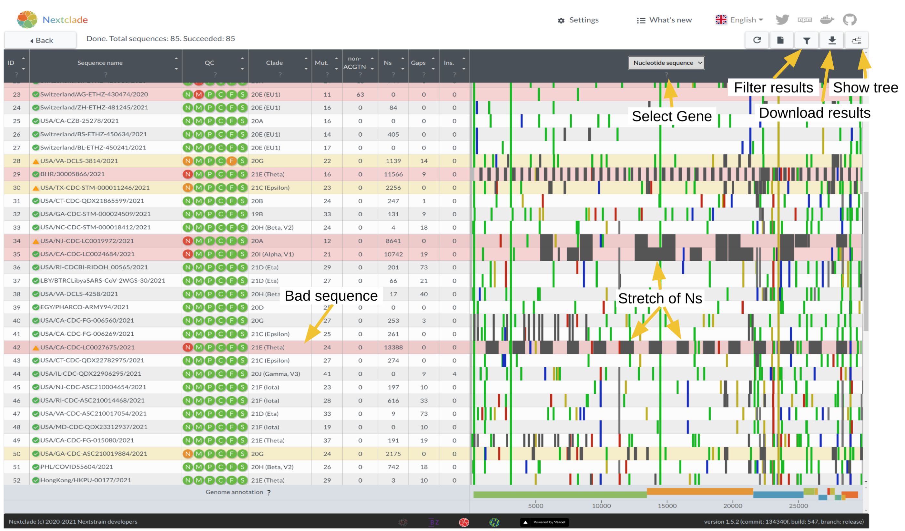
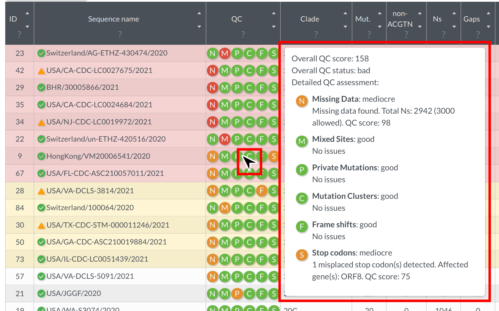
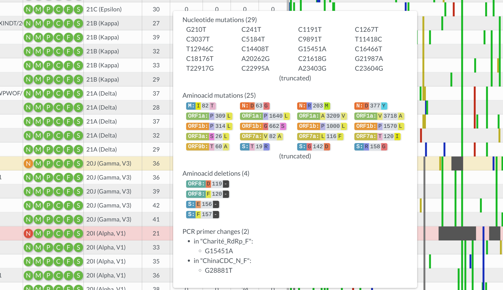
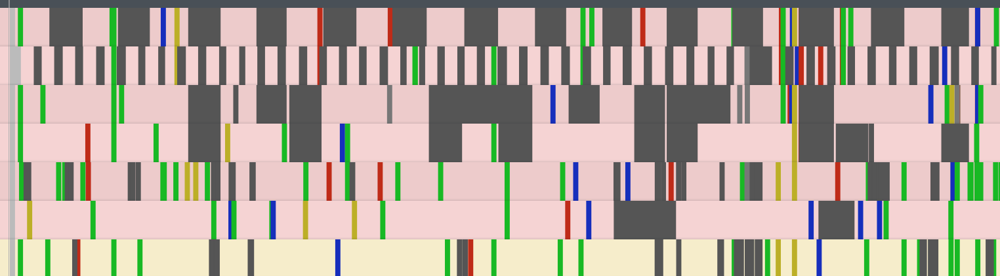
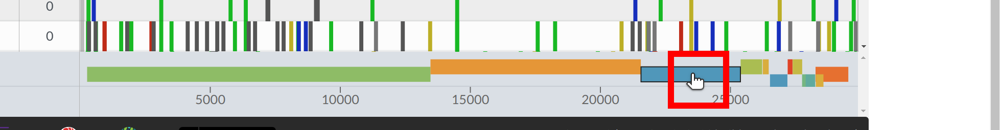
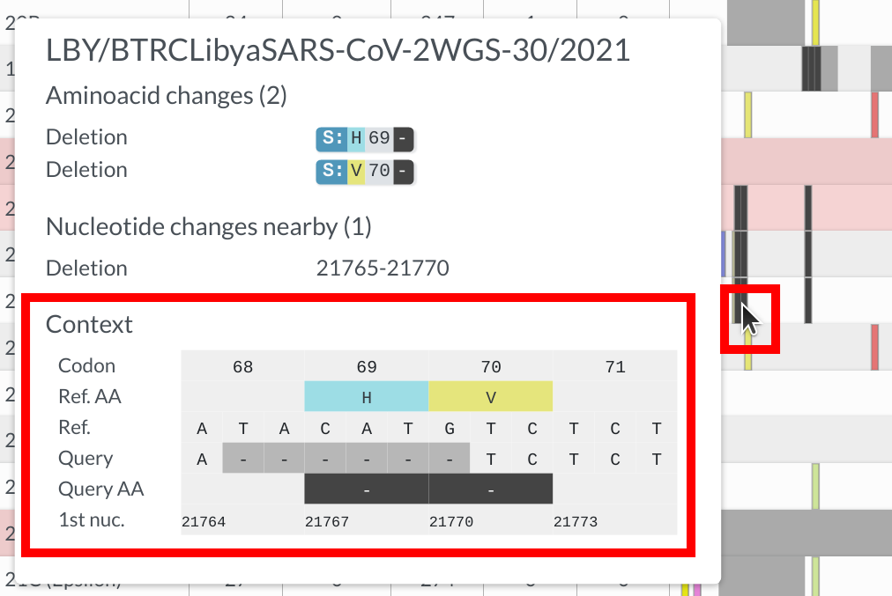

## Analysis results table

Nextclade analyzes your sequences locally in your browser. That means, sequences never leave your computer, ensuring full privacy by design.

> ⚠️ Since your computer is doing all the computational work (rather than a remote server), it is advisable to analyze at most a few hundred of sequences at a time, depending on your computer hardware. Nextclade leverages all processor cores available on your computer and might require large amounts of system memory to operate. For large-scale analysis (thousands to millions of sequences) you might want to try [Nextclade CLI](nextclade-cli) instead.

The analysis pipeline comprises the following steps:

1. Sequence alignment: Sequences are aligned to the reference genome using our custom Nextalign alignment algorithm.
2. Translation: Nucleotide sequences are translated into amino acid sequences.
3. Mutation calling: Nucleotide and amino acid changes are identified
4. Detection of PCR primer changes
5. Phylogenetic placement: Sequences are placed on a reference tree, private mutations analyzed
6. Clade assignment: Clades are taken from the parent node on the tree
7. Quality Control (QC): Quality control metrics are calculated

See [Algorithm](algorithm) section for more details.

You can get a quick overview of the results screen in the screenshot below:

### QC metrics

Nextclade implements a variety of quality control metrics to quickly spot problems in your sequencing/assembly pipeline. You can get a quick idea which of your sequences are having problems by sorting the results table from bad to good (click on the upper arrow in the column "QC"). Bad sequences are colored red, mediocre ones yellow and good ones white. You can view detailed results of the QC metrics by hovering your mouse over a sequences QC entry:

Every icon corresponds to a different metric. See [Quality control](algorithm/07-quality-control) section for the detailed explanation of QC metrics.

### Table data

Nextclade automatically infers the (probable) clade a sequence belongs to and displays the result in the table. Clades are determined by identifying the clade of the nearest neighbour on a reference tree.

The result table further displays for each sequence:

- "Mut.": number of mutations with respect to the root of the reference tree
- "non-ACGTN": number of ambiguous nucleotides that are not _N_
- "Ns": number of missing nucleotides indicated by _N_
- "Gaps": number of nucleotides that are deleted with respect to the reference sequence
- "Ins.": number of nucleotides that are inserted with respect to the reference sequence
- "FS": Number of uncommon frame shifts (total number, including common frame shifts are in parentheses)
- "SC": Number of uncommon premature stop codons (total number, including common premature stops are in parentheses)

Hovering over table entries reveals more detailed information. For example, hovering over the number of mutations reveals which nucleotides and aminoacids have changed with respect to the reference, as well as so-called _private_ mutations (mutations that differ from the nearest neighbor on the reference tree), which are are split into:

- Reversions: mutations back to reference, often a sign of sequencing problems
- Labeled: Mutations that are known, for example because they occur often in a clade. If multiple labeled mutations from the same clade appear, it is a sign of contamination, co-infection or recombination.
- Unlabeled: Mutations that are neither reversions nor labeled.

In the screenshot below, the mouse hovers over a _20J (Gamma)_ sequence. The tooltip shows there are 3 reversion and 4 labeled mutations, indicative of sequence quality problems, potentially a contamination with _20I (Alpha)_.

### Alignment viewer

To the right of the table you can see the alignment with mutations and regions with missing data highlighted in grey. You can quickly check how segments of missing data are distributed on the genome - whether it's a few big chunks clustering in one area or many small missing segments.

You can zoom into a gene by clicking on the respective gene at the bottom, or selecting the gene of interest from the dropdown at the top.

In sequence view, one can observe mutations in a particular gene. One of Nextclade's strengths is that nucleotide and amino acid changes are visualised in the tooltip in a codon-aware way, as you can see in the example below

