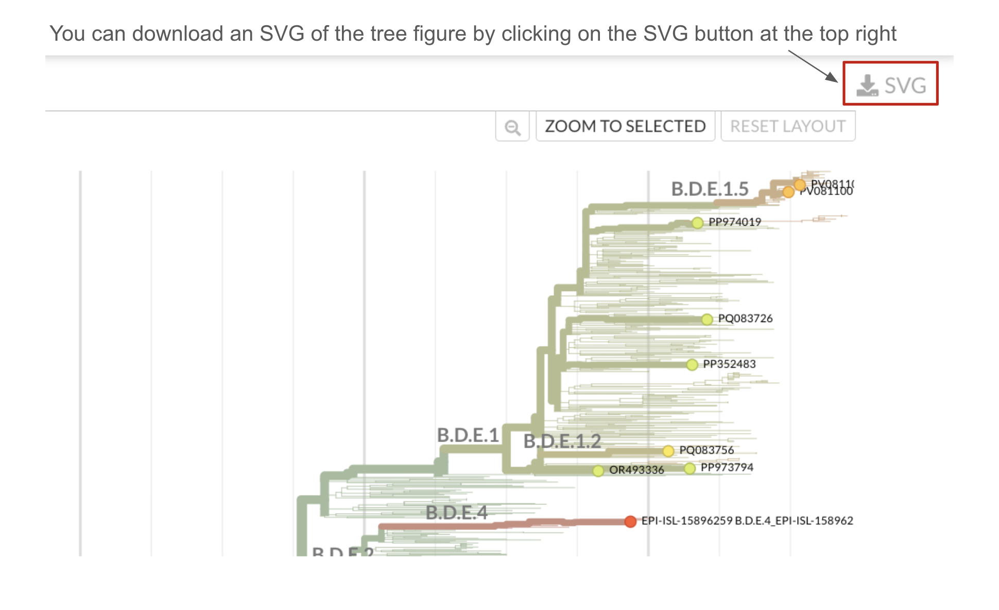
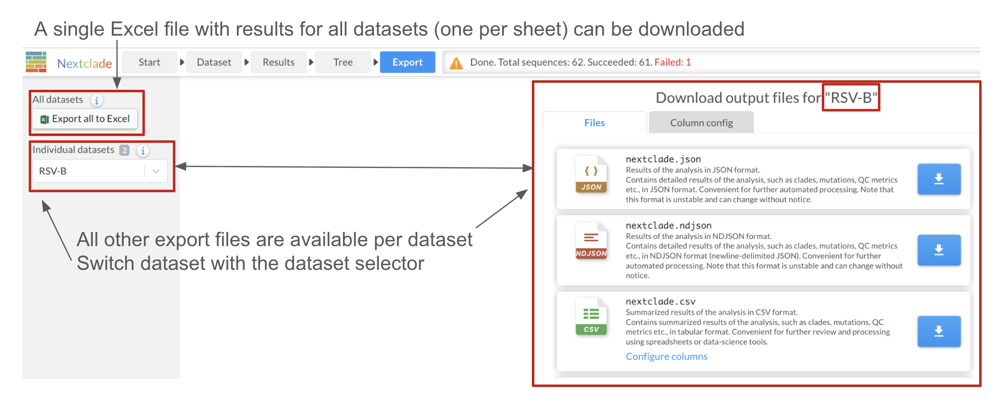

## Export

Once Nextclade has finished the analysis, you can download the results in a variety of formats by clicking the "Export" button in the top panel:

> 💡 We recommend to start with the TSV output file for most users.

See detailed description of the available files in the [Output files](../output-files/index.rst) section.

These are the same files as produced by [Nextclade CLI](../nextclade-cli/index.rst)

For CSV and TSV files, you can choose which columns to include in the output. By default, all columns are included. You can uncheck the columns you don't need.

### SVG of the phylogenetic tree

You can download an SVG file of the phylogenetic tree by clicking on the SVG button at the top right of the tree view.

### Multi-dataset mode

In multi-dataset mode, you can download results for each dataset separately. The dataset selector at the top left lets you switch between datasets.

In addition, you can download results for all datasets in a single Excel file. This file contains one sheet per dataset.
