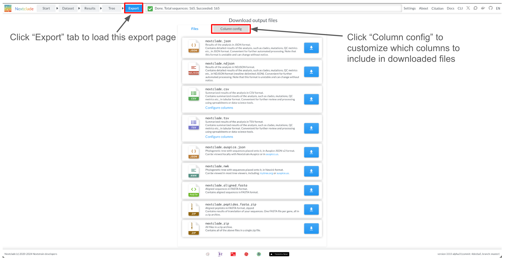

## Export

Once Nextclade has finished the analysis, you can download the results in a variety of formats by clicking the "Export" button in the top panel:

> 💡 We recommend to start with the TSV output file for most users.

See detailed description of the available files in the [Output files](../output-files/index.rst) section.

These are the same files as produced by [Nextclade CLI](../nextclade-cli/index.rst)

For CSV and TSV files, you can choose which columns to include in the output. By default, all columns are included. You can uncheck the columns you don't need.
