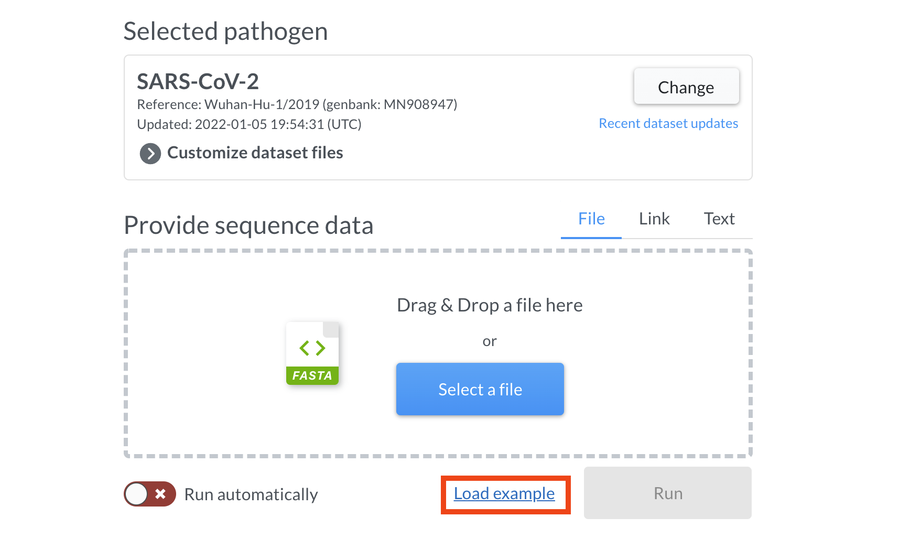
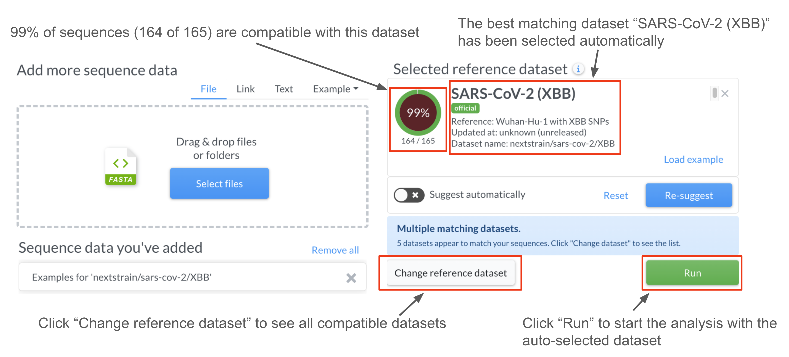

## Getting started

| <video controls autoplay loop muted src="https://github.com/nextstrain/nextclade/assets/9403403/9bf0bab5-b7ee-4161-96a6-23e76ddb56b4" width="680"></video>                                                                  |
| --------------------------------------------------------------------------------------------------------------------------------------------------------------------------------------------------------------------------- |
| Brief video demonstration of Nextclade Web features. A high resolution version is available <a target="_blank" href="https://github.com/nextstrain/nextclade/assets/9403403/9bf0bab5-b7ee-4161-96a6-23e76ddb56b4">here</a>. |

Open [clades.nextstrain.org](https://clades.nextstrain.org) in your browser.

> 💡 For the best viewing experience we recommend using the latest versions of Firefox or Chrome web browsers on a desktop computer or a large laptop.

> ⚠️ Using Safari is discouraged due to its poor support of required web technologies.

Nextclade requires 2 kinds of inputs in order to operate:

1. Sequence data - these are the DNA/RNA consensus sequences that will be analyzed. Sometimes, we also call them "query sequences".
2. Nextclade reference dataset - this is a set of files which encodes specifics of each pathogen (usually a virus). There is a variety of existing datasets to choose from. Advanced users can create their own datasets, in order to add support for more pathogens.

### 1. Provide sequencing data

Nextclade Web accepts sequence data in [FASTA](https://en.wikipedia.org/wiki/FASTA_format) format.

> ⚠️ Note that only uncompressed FASTA files are currently supported. FASTQ and compressed files are not. Even a single sequence requires a FASTA header starting with `>`.

There are a number of options for providing input data to Nextclade, including:

- Drag & Drop a file onto the "upload" area. You can also drag & drop multiple files and directories.
- Pick a file from computer storage: click "Select files". You can also select multiple files and directories.
- Provide a URL (link) to a file publicly available on the internet: click the "Link" tab and paste the URL
- Paste sequence data from clipboard: click the "Paste" tab and paste the fasta data
- Select example sequences: click "Examples" and choose a pathogen from the menu.
- Provide an `input-fasta` URL parameter (See [URL parameters](./url-parameters))

We recommend to analyze at most a few hundred sequences at a time in Nextclade Web. On high-end hardware, Nextclade web can handle up to around 50 MB of input FASTA data. If you need to analyze more sequences, try the command-line version of Nextclade called [Nextclade CLI](../nextclade-cli) which can handle arbitrarily large datasets (300 GB and more).

### 2. Select a dataset

Besides input sequences, Nextclade needs to know which dataset to use to perform the analysis. A dataset is a set of files that configures Nextclade to work with a particular virus or strain. For example, a SARS-CoV-2 dataset contains a SARS-CoV-2 specific reference genome, a genome annotation, a reference tree, and other configuration files. You can learn more about datasets in the [Datasets](../datasets) section.

Most users don't need to worry about the dataset files, because Nextclade provides datasets for a variety of viruses out of the box. The only thing you need to do is to choose an appropriate dataset for your sequences.

Nextclade can automatically suggest compatible datasets by processing the input sequences and comparing them against all available datasets. To do so, click the "Suggest" button after providing some query sequence data (see previous section). If "Suggest automatically" toggle is turned on (this is the default), adding sequences triggers an automatic suggestion run.

Once suggestion engine finishes, if no dataset is currently selected, Nextclade will auto-select the best matching dataset: in this case the SARS-CoV-2 dataset with XBB reference:

The 99% in the circle mean that, according to our suggestion engine, 99% of the input sequences match the reference sequence of the selected dataset. The message in a blue alert box may show that there are other datasets that are also compatible with the input sequences. To see them, click "Change reference dataset" and it will navigate you to the dataset page.

On the dataset page you can see the list of all existing datasets. The subset of suggested datasets is emphasized, while the rest of the datasets are faded. You can stick to the suggested dataset or select the one you think is more appropriate for your data.

On that page You can also find some information about dataset in the "Summary" tab. As well as a history ry of changes in the "History" tab.

Advanced users may override dataset files on the "Customize" tab. This requires good understanding of [Input files](../input-files) and of the [Nextclade algorithms](../algorithm).

### 3. Run the analysis

Once you are happy with the set of sequences and with the selected dataset, click "Run" to start the analysis. Nextclade will then automatically navigate you to the [analysis results page](analysis-results-table).
