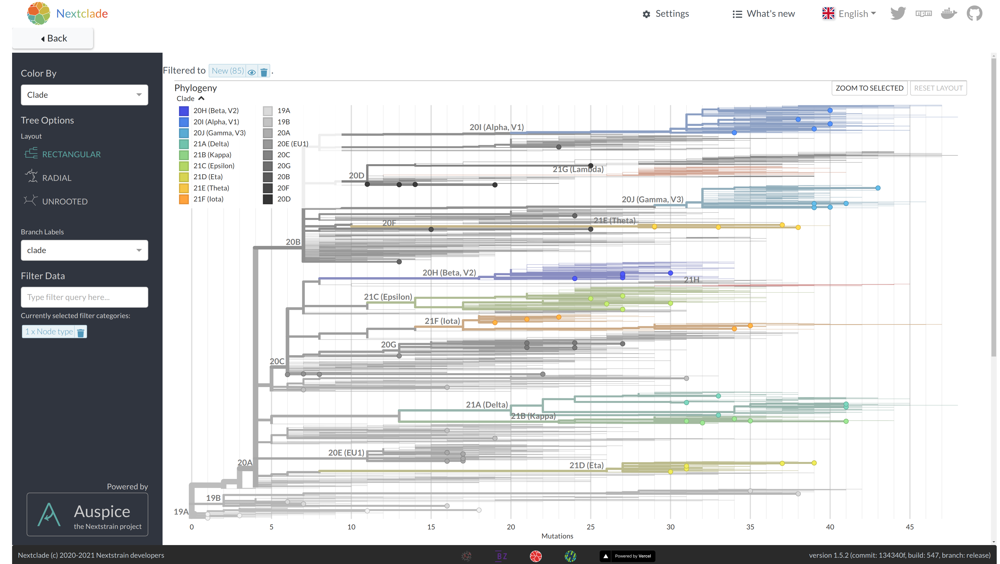
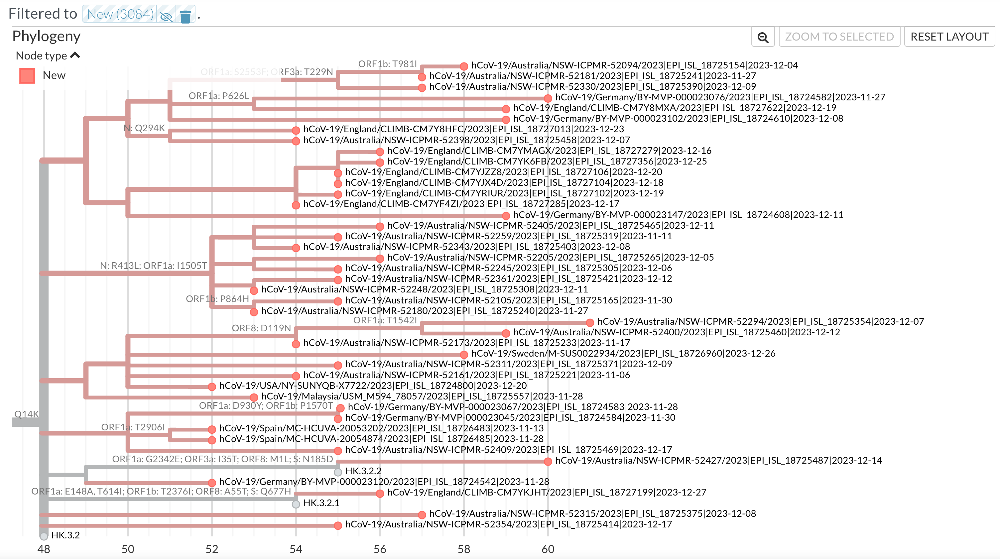

## Phylogenetic tree view

In order to assign clades to sequences, Nextclade [places](../algorithm/05-phylogenetic-placement) all new sequences on a reference tree. You can view the resulting tree by clicking on the tree tab at the top left.

The tree is visualized by [Nextstrain Auspice](https://docs.nextstrain.org/projects/auspice/en/stable/). By default, only your uploaded sequences are highlighted.

Nextclade runs a greedy parsimony tree builder on user provided sequences. This means that approximate ancestral relationships between your sequences are visible on the tree. Given the simplicity of the tree builder, the tree is not guaranteed to be optimal. In the screenshot below, all but the 3 grey sequences are user provided. Nextclade has grouped related user provided sequences into clusters, based on shared mutations.

For a more accurate tree including your sequences, you can use [Usher](https://genome.ucsc.edu/cgi-bin/hgPhyloPlace), which works out of the box with SARS-CoV-2, hMPXV, RSV-A, and RSV-B (as of January 2024).
