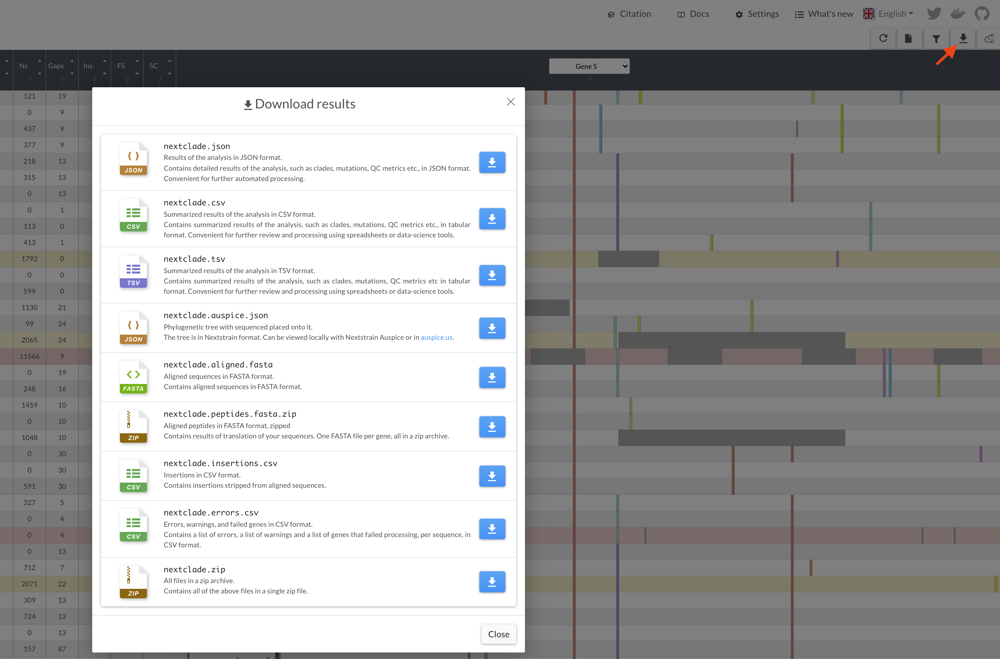

# Output files (v3)

This section describes the files produced by Nextclade.

You can download these files from Nextclade Web using the "Download" dialog.

[](../_images/web_download-options.png)

Nextclade CLI writes these files into paths specified with a family of `--output*` flags.

## All outputs

Nextclade CLI argument: `--output-all`/`-O` `<OUTPUT_DIR>`

All possible outputs can be produced using `--output-all` flag. The default base file name is either "nextclade". It can be changed using `--output-basename`/`-n` `<BASENAME>` argument. The list of outputs can be restricted by passing the files you want as a white space separated list to the `--output-selection`/`-s` argument (possible values: `all`, `fasta`, `json`, `ndjson`, `csv`, `tsv`, `tree`, `tree-nwk`, `translations`. Default: `-s all`, example: `-s fasta ndjson tsv`.

> ⚠️ For CLI users: Note that due to technical limitations of the JSON format, it cannot be streamed entry-by entry, i.e. before writing the output to the file, all entries need to be accumulated in memory. If the JSON results output or tree output is requested (through `--output-json`, `--output-tree` or `--output-all` arguments), for large input data, it can cause very high memory consumption, disk swapping, decreased performance and crashes. Consider removing these outputs for large input data, running on a machine with more RAM, or processing data in smaller chunks.

## Aligned nucleotide sequences

Nextclade CLI argument: `--output-fasta`/`-o` `<FILENAME>`

Aligned sequences are produced as a result of the [sequence alignment](algorithm/01-sequence-alignment) step and are being output in FASTA format. If the CLI flag `--include-reference` is set, the reference sequence is included as the first entry.

All alignments are with respect to the reference sequences. Any insertions relative to the reference are stripped from the output sequences.

> ⚠️Note that if alignment or analysis of an individual sequence fails, it is omitted from the output alignment file.

## Aligned translations

Nextclade CLI: `--output-translations`/`-P` `<TEMPLATE_STRING>`

Aligned peptides are produced as a result of the [translation and peptide alignment](algorithm/02-translation) step and are being output in FASTA format. There are multiple files, one for each gene. If the CLI flag `--include-reference` is set, the reference sequence peptide is included as the first entry. Alignments are with respect to the reference sequences. Any insertions relative to the reference are stripped from the output sequences.

This flag accepts a **template** string which _must_ contain the magic template value `{gene}` exactly once. Default: `nextclade_gene_{gene}.translation.fasta`.

> ⚠️ Note that if translation, alignment or analysis of an individual gene fails, the corresponding peptide is omitted from the output translation file.

> ⚠️ Note that if nucloetide alignment or analysis of an individual sequence fails, none of the translations for this sequence are output translation files.

## Analysis results

The results of mutation calling, clade assignment, quality control and PCR primer changes can be obtained in either TSV, CSV, JSON, or NDJSON format.

> ⚠️Note that if nucleotide alignment or analysis of an individual sequence fails, alignment and translations are omitted from the output fasta files (see above), but the corresponding entry is still present in most of the other output files. In this case the `errors` column/field contain details about why the processing failed.
>
> <br/>
>
> If translation, alignment or analysis of an individual gene fails, the corresponding peptide cannot be analyzed, and therefore no details about aminoacid mutations, deletions, insertions, frame shifts etc. will be available. In this case `warning` and `failedGenes` columns/fields contain details about which genes failed and why.
>
> <br/>
>
> Care should be taken to check for `errors`, `warnings` and `failedGenes` columns or fields, to avoid treating missing or empty entries incorrectly. For example if and `errors` column is non-empty in the TSV output file, it means that the sequence processing failed completely, and treating the empty `substitutions` column as if no mutations detected is incorrect.
>
> <br/>
>
> See descriptions of individual outputs and "Outputs for failed sequences" section below for more details.

The next sections describe each analysis output in more details.

### Tabular (CSV/TSV) results

Nextclade CLI flags: `--output-csv`/`-c`, `--output-tsv`/`-t`

TSV and CSV files are equivalent and only differ in the column delimiter (tabs vs semicolons), for better compatibility with spreadsheet software and data-science packages. Tabular format of TSV/CSV files is somewhat human-friendly and convenient for the immediate inspection and for simple automated processing.

> ⚠️ Note, in CSV and TSV outputs, all positions are 1-based, and all ranges are closed (they include both left and right boundaries).

> ⚠️ Note, all positions are in alignment coordinates and after all the insertions are stripped.

> ⚠️ Note that we use semicolon `;` as the separator for `csv`s as we use comma `,` as field-internal list separators. It is generally recommended to use `tsv` format instead of `csv` format, as it is more robust to the presence of commas in the data.

Every row in tabular output corresponds to 1 input sequence. The meaning of columns is described below:

| Column name                                     | Meaning                                                                                                     | type                            | Example                          |
| ----------------------------------------------- | ----------------------------------------------------------------------------------------------------------- | ------------------------------- | -------------------------------- |
| index                                           | Index (integer signifying location) of a corresponding record in the input fasta file(s)                    | non-negative integer            | 0                                |
| seqName                                         | Name of the sequence (as provided in the input file)                                                        | string                          | hCoV-19/USA/SEARCH-4652-SAN/2020 |
| clade                                           | Assigned clade                                                                                              | string                          | 20A                              |
| qc.overallScore                                 | Overall [quality control](algorithm/07-quality-control) score                                               | float                           | 23.5                             |
| qc.overallStatus                                | Overall [quality control](algorithm/07-quality-control) status                                              | string: `good\|mediocre\|bad`   | mediocre                         |
| totalSubstitutions                              | Total number of detected nucleotide substitutions                                                           | non-negative integer            | 2                                |
| totalDeletions                                  | Total number of deleted nucleotide bases                                                                    | non-negative integer            | 15                               |
| totalInsertions                                 | Total number of inserted nucleotide bases                                                                   | non-negative integer            | 3                                |
| totalFrameShifts                                | Total number of detected frame shifts                                                                       | non-negative integer            | 0                                |
| totalAminoacidSubstitutions                     | Total number of detected aminoacid substitutions                                                            | non-negative integer            | 1                                |
| totalAminoacidDeletions                         | Total number of deleted amino acid residues                                                                 | non-negative integer            | 7                                |
| totalAminoacidInsertions                        | Total number of inserted amino acid residues                                                                | non-negative integer            | 8                                |
| totalMissing                                    | Total number of detected missing nucleotides (nucleotide character `N`)                                     | non-negative integer            | 238                              |
| totalNonACGTNs                                  | Total number of detected ambiguous nucleotides (nucleotide characters that are not `A`, `C`, `G`, `T`, `N`) | non-negative integer            | 2                                |
| totalUnknownAa                                  | Total number of unknown aminoacids (aminoacid character `X`)                                                | non-negative integer            | 0                                |
| totalPcrPrimerChanges                           | Total number of nucleotide mutations detected in PCR primer regions                                         | non-negative integer            | 0                                |
| substitutions                                   | List of detected nucleotide substitutions                                                                   | comma separated list of strings | C241T,C2061T,C11514T,G23012A     |
| deletions                                       | List of detected nucleotide deletion ranges                                                                 | comma separated list of strings | 201,28881-28882                  |
| insertions                                      | List of detected inserted nucleotide fragments                                                              | comma separated list of strings | 248:G,21881:GAG                  |
| privateNucMutations.reversionSubstitutions      | List of detected private mutations that are reversions to reference                                         | comma separated list of strings | C241T                            |
| privateNucMutations.labeledSubstitutions        | List of detected private mutations that are to a genotype that has been labeled in `virus_properties.json`  | comma separated list of strings | C11514T\|21I&20C,C2061T\|21E     |
| privateNucMutations.unlabeledSubstitutions      | List of detected private mutations that are neither reversions nor labeled                                  | comma separated list of strings | G23012A                          |
| privateNucMutations.totalReversionSubstitutions | Total number of private mutations that are reversions to reference                                          | non-negative integer            | 1                                |
| privateNucMutations.totalLabeledSubstitutions   | Total number of private mutations that are to a genotype that has been labeled in `virus_properties.json`   | non-negative integer            | 2                                |
| privateNucMutations.totalUnlabeledSubstitutions | Total number of private mutations that are neither reversions nor labeled                                   | non-negative integer            | 1                                |
| privateNucMutations.totalPrivateSubstitutions   | Total number of private mutations overall                                                                   | non-negative integer            | 4                                |
| frameShifts                                     | List of detected frame shifts                                                                               | comma separated list of strings | N:33-420                         |
| aaSubstitutions                                 | List of detected aminoacid substitutions                                                                    | comma separated list of strings | E:T9I,N:R203K                    |
| aaDeletions                                     | List of detected aminoacid deletions                                                                        | comma separated list of strings | N:E31-,N:E32-                    |
| aaInsertions                                    | List of detected aminoacid insertions                                                                       | comma separated list of strings | S:214:EPE                        |
| missing                                         | List of detected missing nucleotides (nucleotide character `N`)                                             | comma separated list of strings | 704-726,4248                     |
| nonACGTNs                                       | List of detected ambiguous nucleotides (nucleotide characters that are not `A`, `C`, `G`, `T`, `N`)         | comma separated list of strings | Y:27948,K:3877                   |
| unknownAaRanges                                 | List of detected contiguous ranges of unknown aminoacid (aminoacid character `X`)                           | comma separated list of strings | E:1-12,E:29                      |
| pcrPrimerChanges                                | List of detected PCR primer changes                                                                         | comma separated list of strings |                                  |
| alignmentScore                                  | Alignment score                                                                                             | non-negative integer            | 88237                            |
| alignmentStart                                  | Beginning of the sequenced region                                                                           | non-negative integer            | 1                                |
| alignmentEnd                                    | End of the sequenced region                                                                                 | non-negative integer            | 29903                            |
| qc.missingData.missingDataThreshold             | Threshold that was used for "Missing data" QC rule                                                          | int                             | 3000                             |
| qc.missingData.score                            | Score for "Missing data" QC rule                                                                            | float                           | 0.5                              |
| qc.missingData.status                           | Status for "Missing data" QC rule                                                                           | string: `good\|mediocre\|bad`   | mediocre                         |
| qc.missingData.totalMissing                     | Total number of missing nucleotides used in "Missing data" QC rule                                          | non-negative integer            | 238                              |
| qc.mixedSites.mixedSitesThreshold               | Threshold used for "Mixed sites" QC rule                                                                    | int                             | 10                               |
| qc.mixedSites.score                             | Score for "Mixed sites" QC rule                                                                             | float                           | 0.5                              |
| qc.mixedSites.status                            | Status for "Mixed sites" QC rule                                                                            | string: `good\|mediocre\|bad`   | good                             |
| qc.mixedSites.totalMixedSites                   | Total number of ambiguous nucleotides used for "Mixed sites" QC rule                                        | non-negative integer            | 2                                |
| qc.privateMutations.cutoff                      | Cutoff parameter used for "Private mutations" QC rule                                                       | int                             | 3                                |
| qc.privateMutations.excess                      | Excess parameter used for "Private mutations" QC rule                                                       | int                             | 1                                |
| qc.privateMutations.score                       | Score for "Private mutations" QC rule                                                                       | float                           | 0.5                              |
| qc.privateMutations.status                      | Status for "Private mutations" QC rule                                                                      | string: `good\|mediocre\|bad`   | good                             |
| qc.privateMutations.total                       | Weighted sum of private mutations used for "Private mutations" QC rule                                      | non-negative integer            | 4                                |
| qc.snpClusters.clusteredSNPs                    | Clustered SNP detected for "SNP clusters" QC rule                                                           | comma separated list of strings | C241T,C2061T                     |
| qc.snpClusters.score                            | Score for "SNP clusters" QC rule                                                                            | float                           | 0.5                              |
| qc.snpClusters.status                           | Status for "SNP clusters" QC rule                                                                           | string: `good\|mediocre\|bad`   | bad                              |
| qc.snpClusters.totalSNPs                        | Total number of SNPs for "SNP clusters" QC rule                                                             | non-negative integer            | 2                                |
| qc.frameShifts.frameShifts                      | List of detected frame shifts in "Frame shifts" QC rule (excluding ignored)                                 | comma separated list of strings | N:33-420                         |
| qc.frameShifts.totalFrameShifts                 | Total number of detected frame shifts in for "Frame shifts" QC rule (excluding ignored)                     | non-negative integer            | 1                                |
| qc.frameShifts.frameShiftsIgnored               | List of frame shifts detected, but ignored due to ignore list                                               | comma separated list of strings | ORF8:109-111                     |
| qc.frameShifts.totalFrameShiftsIgnored          | Total number of frame shifts detected, but ignored due to ignore list                                       | non-negative integer            | 1                                |
| qc.frameShifts.score                            | Score for "Frame shifts" QC rule                                                                            | float                           | 0.5                              |
| qc.frameShifts.status                           | Status for "Frame shifts" QC rule                                                                           | string: `good\|mediocre\|bad`   | bad                              |
| qc.stopCodons.stopCodons                        | List of detected stop codons in "Stop codons" QC rule                                                       | comma separated list of strings | ORF1a:4715,ORF1a:4716            |
| qc.stopCodons.totalStopCodons                   | Total number of detected stop codons in "Stop codons" QC rule                                               | non-negative integer            | 2                                |
| qc.stopCodons.score                             | Score for "Stop codons" QC rule                                                                             | float                           | 0.5                              |
| qc.stopCodons.status                            | Status for "Stop codons" QC rule                                                                            | string: `good\|mediocre\|bad`   | bad                              |
| isReverseComplement                             | Whether query sequences were transformed using reverse complement operation before alignment                | boolean                         | false                            |
| errors                                          | List of errors during processing                                                                            | comma separated list of strings |                                  |
| warnings                                        | List of warnings during processing                                                                          | comma separated list of strings |                                  |
| failedGenes                                     | List of genes that failed translation                                                                       | comma separated list of strings |                                  |

> ⚠️ Note that sequence names (`seqName` column) are not guaranteed to be unique (and in practice are not unique very often). So indices is the only way to reliably link together inputs and outputs.

The table can contain additional columns for every clade-like attribute defined in reference tree in `meta.extensions.clade_node_attrs` and in the node attributes. For example, the default SARS-CoV-2 datasets define `Nextclade_pango` attribute which signifies a Pango lineage assigned by Nextclade (see [Nextclade as pango lineage classifier: Methods and Validation](algorithm/nextclade-pango)).

### JSON results

Nextclade CLI flag: `--output-json`/`-J`, filename `nextclade.json`.

JSON results file is best for in-depth automated processing of results. It contains everything tabular files contain, plus more, in a more machine-friendly format.

> ⚠️ For CLI users: Note that due to technical limitations of the JSON format, it cannot be streamed entry-by entry, i.e. before writing the output to the file, all entries need to be accumulated in memory. If the JSON output is requested (through `--output-json` or `--output-all` arguments), for large input data, it can cause very high memory consumption, disk swapping, decreased performance and crashes. Consider removing this output for large input data, running on a machine with more RAM, or processing data in smaller chunks.

> ⚠️ Beware that JSON results reflect internal state of Nextclade, and use 0-indexed nucleotide and codon positions, whereas CSV and TSV files use 1-indexed positions (widely used in bioinformatics). The reason is, that JSON corresponds more closely to the internal representation and 0-indexing is the default in most programming languages. For example, substitution `{refNuc: "C", pos: 2146, queryNuc: "T"}` in JSON results corresponds to substitution `C2147T` in csv and tsv files.
>
> Ranges are inclusive for the start and exclusive for the end. Hence, `missing: {begin: 704, end: 726}` in JSON results corresponds to `missing: 705-726` in CSV/TSV results.

> ⚠️ Note, all positions are in alignment coordinates and after all the insertions stripped.

### NDJSON results

Nextclade CLI flag: `--output-ndjson`/`-N`, filename `nextclade.ndjson`,

NDJSON results are similar to the JSON results - it combines `results` and `errors` arrays from it, and similarly suited well for in-depth automated processing of results. It contains everything tabular files contain, plus more, in a more machine-friendly format. Compared to JSON format, NDJSON can be streamed and piped one line at a time, and does not cause increased memory consumption for large input data.

> ⚠️ Beware that NDJSON results reflect internal state of Nextclade, and use 0-indexed nucleotide and codon positions, whereas CSV and TSV files use 1-indexed positions (widely used in bioinformatics). The reason is, that JSON corresponds more closely to the internal representation and 0-indexing is the default in most programming languages. For example, substitution `{refNuc: "C", pos: 2146, queryNuc: "T"}` in JSON results corresponds to substitution `C2147T` in csv and tsv files.
>
> Ranges are inclusive for the start and exclusive for the end. Hence, `missing: {begin: 704, end: 726}` in NDJSON results corresponds to `missing: 705-726` in CSV/TSV results.

> ⚠️ Note, all positions are in alignment coordinates and after all the insertions stripped.

## Output phylogenetic tree

Nextclade CLI flags: `--output-tree`/`-T`, filename: `nextclade.auspice.json`.

Output phylogenetic tree. This is the input [reference tree](terminology.html#reference-tree-concept), with [query sequences](terminology.html#query-sequence) placed onto it.

The tree is in Auspice JSON v2 format ([description](https://nextstrain.org/docs/bioinformatics/data-formats), [schema](https://github.com/nextstrain/augur/blob/master/augur/data/schema-export-v2.json)) - this is the same format that is used by Nextstrain's Augur and Auspice. And the same as used for the input [reference tree](terminology.html#reference-tree-concept).

The tree can be visualized online in [auspice.us](https://auspice.us) or in a local instance of [Nextstrain Auspice](https://docs.nextstrain.org/projects/auspice/en/stable/index.html).

> ⚠️ Note that if alignment or analysis of an individual sequence fails, it cannot participate in phylogenetic placement and is omitted from the output tree.

> ⚠️ For CLI users: Note that due to technical limitations of the JSON format, it cannot be streamed entry-by entry, i.e. before writing the output to the file, all entries need to be accumulated in memory. If the tree output is requested (through `--output-tree` or `--output-all` arguments), for large input data, it can cause very high memory consumption, disk swapping, decreased performance and crashes. Consider removing this output for large input data, running on a machine with more RAM, or processing data in smaller chunks.

> ⚠️ Note, all positions are in alignment coordinates and after all the insertions stripped.

## Output phylogenetic tree in Newick format

Nextclade CLI flags: `--output-tree-nwk`, filename: `nextclade.nwk`.

To allow for compatibility with other software, Nextclade can output the tree in Newick format. This is a text-based format for representing phylogenetic trees as nested sets. It is widely used in bioinformatics.

## Outputs for failed sequences

When processing of a sequence fails for various reasons, not all output files will contain the corresponding entry (due to limitations of file formats):

| Output file                  | CLI arg                 | Failed entries? |
| ---------------------------- | :---------------------- | :-------------- |
| Aligned nucleotide sequences | `--output-fasta`        | no              |
| Aligned peptides             | `--output-translations` | no              |
| Auspice tree JSON            | `--output-tree`         | no              |
| Newick tree                  | `--output-tree`         | no              |
| Analysis results CSV         | `--output-csv`          | yes             |
| Analysis results TSV         | `--output-tsv`          | yes             |
| Analysis results NDJSON      | `--output-ndjson`       | yes             |
| Analysis results JSON        | `--output-json`         | yes             |

## Compression of output files and writing to standard output (stdout)

If any of the output filenames ends with one of the supported file extensions: `gz`, `bz2`, `xz`, `zstd`, it will be transparently compressed. Low compression level is used (roughly corresponds to level "2" for most formats).

If the output filename is `-` then the output will be written uncompressed to standard output (stdout).

If a custom compression or other form of post-processing is needed, then you can tell Nextclade to write to stdout and then pipe the stdout to another program. For example:

```bash
xzcat input.fasta.xz |
nextalign run -r reference.fasta -m genemap.gff -o - |
xz -9 > aligned.slowly.but.heavily.compressed.fasta.xz
```

```bash
xzcat *.fasta.xz |
nextclade run -D dataset/ --output-tsv=- |
process_nextclade_tsv_further > processed.tsv
```
